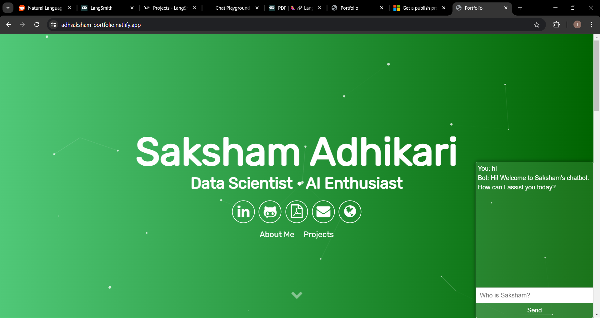
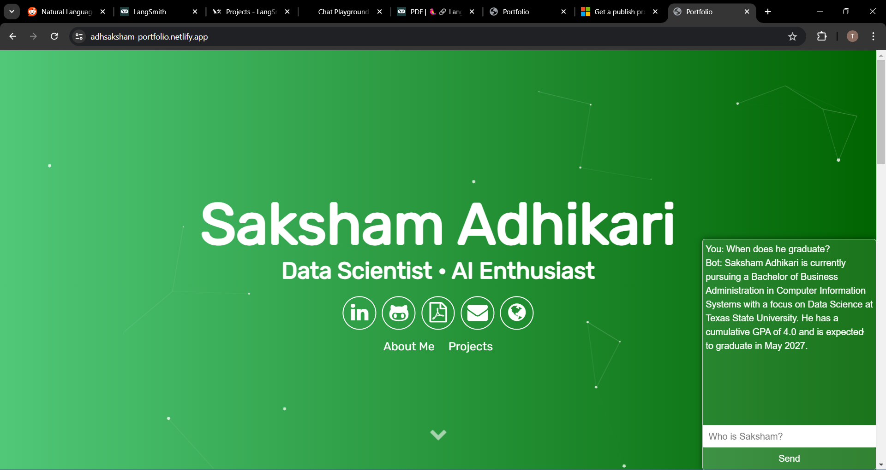
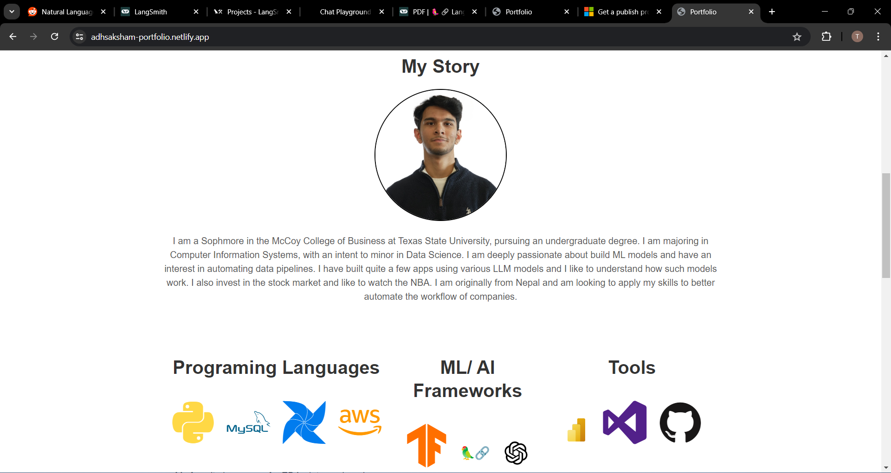

# Portfolio Website

https://adhsaksham-portfolio.netlify.app/

Welcome to my portfolio website! This site is a showcase of my projects, experience, and journey in the field of computer information systems and data science. It features a customized chatbot that can answer questions about me and provide more information about my work and background.

## Features

- **Home Page**: The front page includes a welcoming photo and a chat box where visitors can interact with the customized chatbot.
- **About Me**: This section highlights my experience, learning journey, and accomplishments.
- **Projects**: A detailed display of the projects I have worked on, showcasing my skills and contributions.

## Customized Chatbot

The chatbot is designed to provide personalized responses to questions about me. It can answer queries regarding my background, projects, skills, and more. This feature enhances user interaction and makes it easier for visitors to learn more about my work.

## Technologies Used

- **HTML**: For structuring the content on the web pages.
- **CSS**: For styling and enhancing the visual appearance of the website.
- **JavaScript**: For adding interactivity and dynamic content.
- **OpenAI API**: Integrated for the chatbot functionality to provide intelligent responses.
- 

## Screenshots

# Acknowledgements  
Thanks to all the tutorials and resources that helped me learn and build this website.  

Big thank you to Aditya Vikram Singht @ https://github.com/AVS1508/My-Alternate-Portfolio-Website for the website design template.   

# License
This project is licensed under the MIT License. 

# Reach Out and Help
I had a great time building this website and integrating the chatbot. I hope you find it informative and engaging!

For any issues or suggestions, please open an issue or contact me directly.

© 2024 Saksham Adhikari. All rights reserved.

